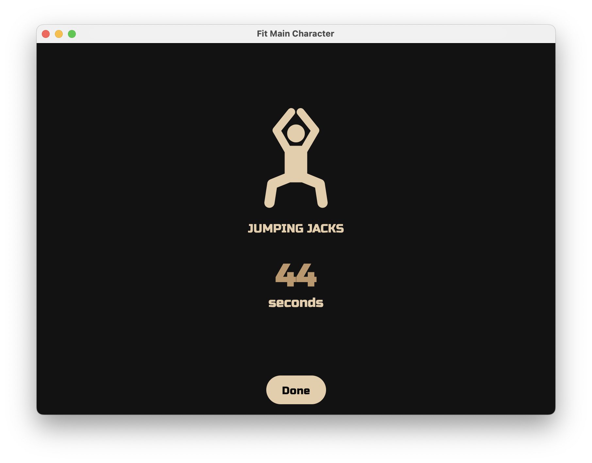
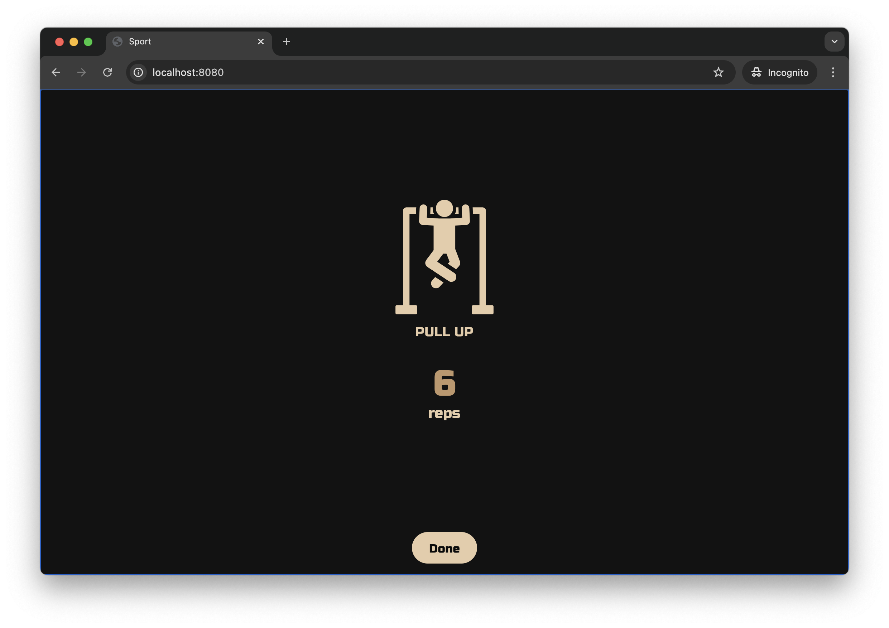
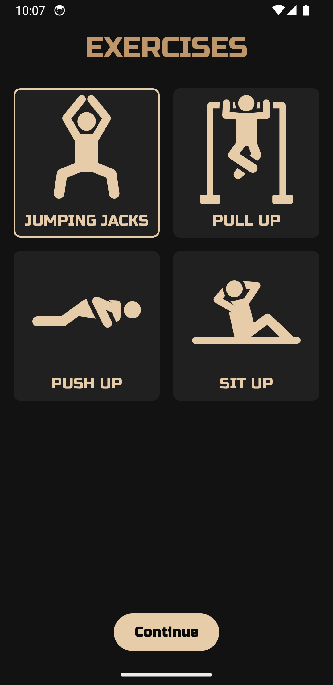
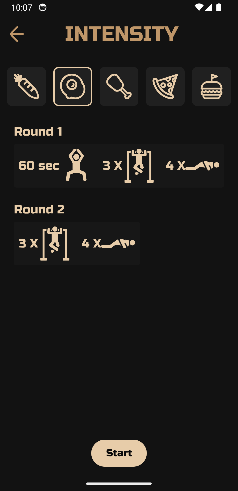
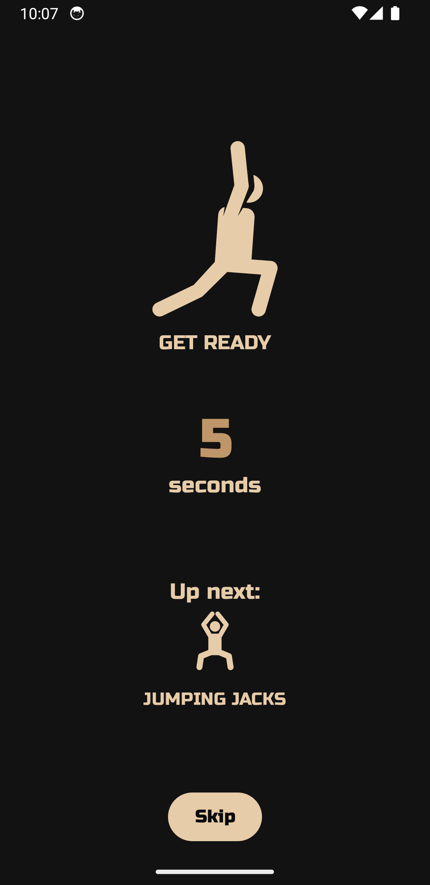
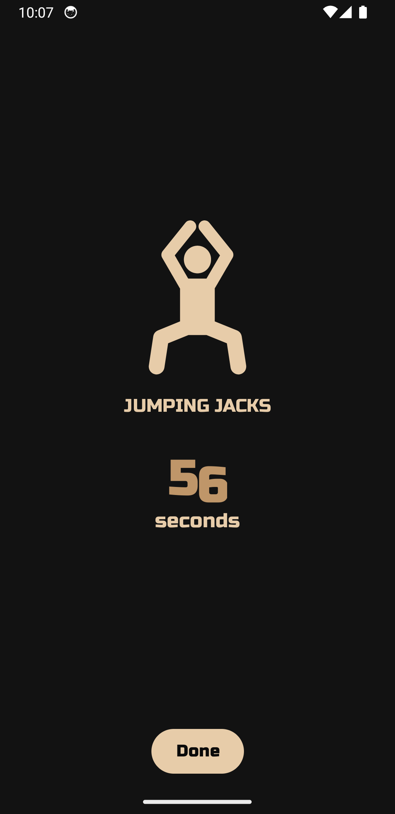
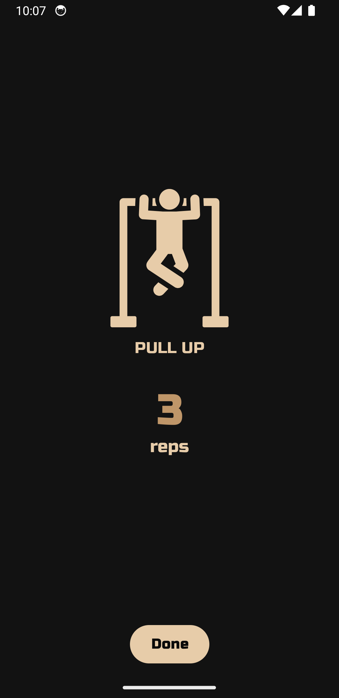
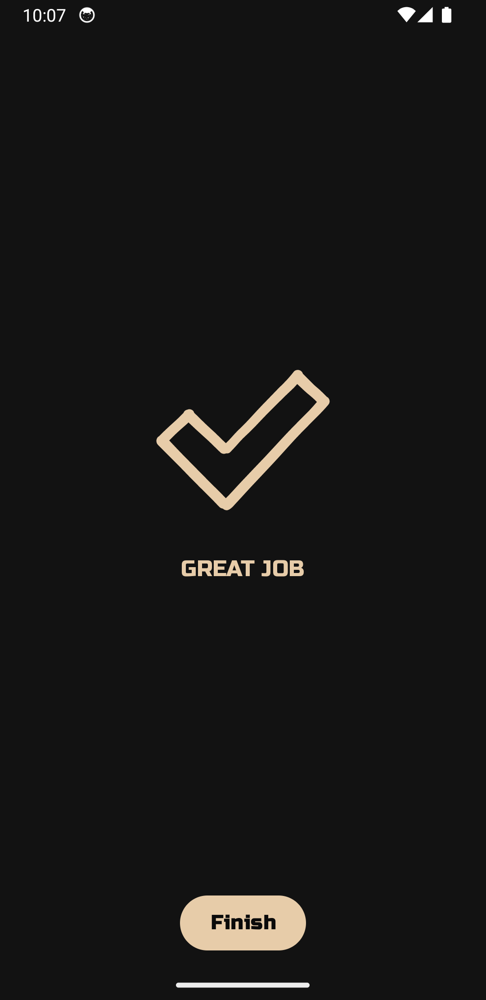

# Fit Main Character

   

A **cross-platform open-source workout application** that runs on **Android, iOS, Windows, Mac, Linux, and the Web**.

**NOTE:** The current selection of exercises is fairly limited. I **welcome contributions** of new exercises, images, and Lottie animations to help visualize the workouts better.

## Screenshots

### Desktop

### Web

### Mobile

## Libraries

### Audio

https://github.com/kkostov/gadulka

## Credits

Audio files: https://ttsmaker.com/

Icons: https://www.svgrepo.com/
